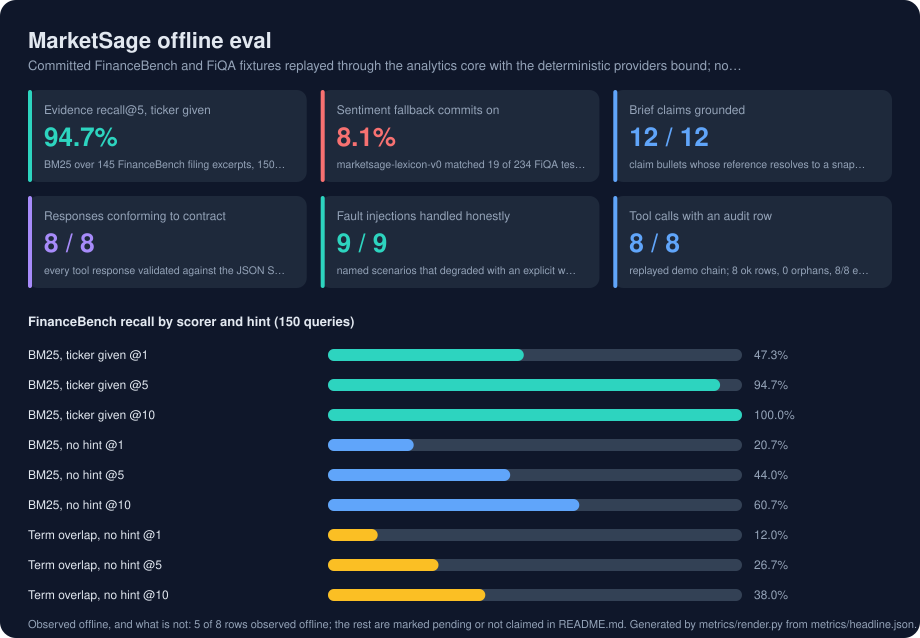

# MarketSage

**An MCP-native market intelligence workbench: a traditional analyst workflow, exposed to LLM clients as tools, with every run saved and every source caveated.**

A Go MCP gateway exposes seven finance tools and a saved-run resource over stdio. Behind it, a Python FastAPI analytics core provides market snapshots, price history, sentiment scoring, evidence search and research briefs, with an OpenBB-ready market adapter and a Hugging Face dataset boundary. DuckDB persists dataset manifests, research runs and audit events. A Next.js workbench gives analysts the same capabilities as a conventional application surface.

MarketSage does not execute trades, move money or provide investment advice.

---

## At a glance

| | |
|---|---|
| **The problem** | Analyst teams have a workflow that works. LLM clients want to use it. Bolting a chat box onto a finance app gives the model no structure, no provenance and no record; exposing the workflow as typed tools with saved, auditable runs does. |
| **What it does** | Seven MCP tools (`health_check`, `dataset_status`, `market_snapshot`, `price_history`, `sentiment_score_text`, `evidence_search`, `research_brief`) a `marketsage://runs/{run_id}` resource and four prompts; seeded, hybrid and live data modes with explicit warnings when live data is unavailable; deterministic sentiment with opt-in FinBERT; BM25 evidence retrieval over a committed FinanceBench filing corpus, ticker-scoped; research briefs whose every bullet carries a reference to the artefact behind it; DuckDB audit and run persistence; optional bearer auth; a Next.js analyst workbench. |
| **Stack** | Go 1.24 (MCP gateway), Python 3.12 with FastAPI and `uv` (analytics core), TypeScript MCP SDK (client), Next.js and React (workbench), DuckDB, optional OpenBB, Hugging Face datasets and models, GitHub Actions. |
| **Validation** | One gate, `npm run check`: docs, `ruff`, `pytest`, `go fmt`/`test`/`vet`, an MCP CLI smoke across all seven tools and the saved-run resource, the Next.js production build, an offline evaluation (`npm run eval`) scored on committed FinanceBench and FiQA fixtures with drift checks on the results card and the generated contract, and a workspace check. Plus `npm run audit:deps`: `npm audit`, `uv pip check`, `govulncheck`, and a secret scan. Desktop and mobile browser verification of the workbench. |

<!-- metrics:start -->

## Results



Every figure below was observed by `npm run eval`, which runs offline with a fixed seed and no API key, and writes `metrics/headline.json`. Committed FinanceBench and FiQA fixtures replayed through the analytics core with the deterministic providers bound; no network, no key, no model download. Rows marked *pending* need hardware, data or a service the offline harness does not have; nothing here is estimated.

| Metric | Value | How it was measured |
|---|---|---|
| Evidence recall@5, ticker given | **94.7%** | BM25 over 145 FinanceBench filing excerpts, 150 labelled queries; without the ticker hint recall@5 is 44.0% (MRR 0.33, nDCG@10 0.38), so the structured hint does the heavy lifting |
| Sentiment fallback commits on | **8.1%** | marketsage-lexicon-v0 matched 19 of 234 FiQA test sentences and was right on 89.5% of those; accuracy over every row 8.1% against a 61.5% majority baseline; ECE 0.24; FinBERT is the real path and is pending |
| Brief claims grounded | **12 / 12** | claim bullets whose reference resolves to a snapshot, evidence id or sentiment hash in the same payload; 5 tickers, 3 with no committed evidence said so instead of borrowing another company's |
| Responses conforming to contract | **8 / 8** | every tool response validated against the JSON Schema generated from the Pydantic models; Go decodes the same fixtures with unknown fields forbidden; schema file in sync |
| Fault injections handled honestly | **9 / 9** | named scenarios that degraded with an explicit warning or failed with a clean error and an audit row; none returned invented data |
| Tool calls with an audit row | **8 / 8** | replayed demo chain; 8 ok rows, 0 orphans, 8/8 envelopes carry source, mode, timestamp and caveats |

**FinanceBench recall by scorer and hint (150 queries)**

| | | |
|---|---|---|
| BM25, ticker given @1 | `█████████░░░░░░░░░░░` | 47.3% |
| BM25, ticker given @5 | `███████████████████░` | 94.7% |
| BM25, ticker given @10 | `████████████████████` | 100.0% |
| BM25, no hint @1 | `████░░░░░░░░░░░░░░░░` | 20.7% |
| BM25, no hint @5 | `█████████░░░░░░░░░░░` | 44.0% |
| BM25, no hint @10 | `████████████░░░░░░░░` | 60.7% |
| Term overlap, no hint @1 | `██░░░░░░░░░░░░░░░░░░` | 12.0% |
| Term overlap, no hint @5 | `█████░░░░░░░░░░░░░░░` | 26.7% |
| Term overlap, no hint @10 | `████████░░░░░░░░░░░░` | 38.0% |

**Observed offline, and what is not**

| | Status | Evidence |
|---|---|---|
| Committed fixtures | observed | FinanceBenchRetrieval corpus/test 145 rows, FinanceBenchRetrieval queries/test 150 rows, FinanceBenchRetrieval qrels/test 150 rows, fiqa-sentiment-classification default/test 234 rows; MIT licensed, sha256-pinned in data/fixtures/manifest.json |
| Sentiment confidence calibration | observed | ECE 0.24 on 19 committed predictions; the confidence field is a term-count formula, not a probability |
| Evidence coverage | observed | 2 of 5 seeded tickers have filing excerpts in the corpus; the rest get an explicit coverage warning |
| Latency budget (NFR-008) | observed | 8 of 8 tools under 2 s p95 in-process over 5 runs; timings kept in metrics/eval-latest.json, not here, because they vary by host |
| MCP surface | observed | 7 tools, 4 prompts, 1 resource template, read from `marketsage-mcp --describe` |
| FinBERT sentiment accuracy | pending | pending: needs MARKETSAGE_ENABLE_MODEL_DOWNLOADS=true and a model download; the offline harness scores the lexicon fallback only |
| Embedding retrieval | pending | pending: bge-small / MiniLM path is not implemented; lexical scorers only |
| Live OpenBB market data | pending | pending: seeded prices are illustrative and are not scored; live mode needs the optional OpenBB dependency and provider configuration |

<!-- metrics:end -->

## Architecture

```
LLM host / MCP client ──stdio JSON-RPC──► Go MCP gateway ──HTTP──► Python analytics core
                                                                      ├── OpenBB-ready market adapter
Next.js analyst workbench ──server-side proxy───────────────────────────────────►  ├── Hugging Face dataset/model boundary
                                                                      └── DuckDB: manifests, runs, audit events
```

Three languages, each where it is strongest: Go for a transport-disciplined MCP server that never writes to stdout in stdio mode, Python for the data and model integrations, TypeScript for the client and the product surface. One schema in `packages/contracts/marketsage.schema.json` describes the shared payloads. It is generated from the Pydantic models, every response is validated against it, and the Go client decodes the exported fixtures with unknown fields forbidden.

## Quick start

Requires Node.js 22+, Go 1.24+ and `uv`.

```bash
npm install
npm run check        # the gate
npm run demo:mcp     # a TypeScript MCP client starts the stack, lists tools, runs the chain, reads a saved run
npm run eval         # the offline evaluation behind the results card above; npm run card re-renders it
```

For the workbench, in two terminals:

```bash
npm run dev:analytics
npm run dev --workspace apps/web     # http://localhost:3000, then Run Brief
```

## Data and model modes

| Mode | Behaviour |
|---|---|
| `seeded` | Deterministic local data from `data/seed/`; no credentials, no network. The default. |
| `hybrid` | Tries live OpenBB data and falls back to seeded data, with a warning in the response so the fallback is never silent. |
| `live` | Requires the optional OpenBB dependencies and fails clearly when they are missing. |

Model downloads are off by default. `MARKETSAGE_ENABLE_MODEL_DOWNLOADS=true` enables FinBERT; otherwise the deterministic sentiment fallback is used and reported as such.

## Protected local mode

The analytics API is open for local demos. Set `MARKETSAGE_HTTP_TOKEN` to require bearer auth; the Go gateway and the Next.js proxy forward the same token server-side.

## Documentation

| | |
|---|---|
| [`docs/OVERVIEW.md`](docs/OVERVIEW.md) | The problem, the design and its reasons, what is measured |
| [`docs/SHOWCASE.md`](docs/SHOWCASE.md) | A guided tour of every feature, with commands and files |
| [`docs/demo-script.md`](docs/demo-script.md) | A five-minute walkthrough |
| [`docs/security-and-ops.md`](docs/security-and-ops.md) | Security posture, dependency sweeps, operational notes |
| [`docs/research/source-notes.md`](docs/research/source-notes.md) | Which datasets and models were reviewed, and why some were excluded |
| [`docs/third-party-notices.md`](docs/third-party-notices.md) | Licences of everything used |
| [`docs/ship-report.md`](docs/ship-report.md) | Validation evidence and known limitations |
| [`docs/tasks/T-013-offline-evaluation-harness.md`](docs/tasks/T-013-offline-evaluation-harness.md) | What the evaluation harness measures, how, and what it deliberately leaves pending |
| [`docs/design/`](docs/design/) | Requirements, high-level design, low-level design, execution plan, decisions |
| [`docs/graph/README.md`](docs/graph/README.md) | The codebase knowledge graph (graphify): how to build it, query it, and what it excludes |

## License

`AGPL-3.0-only`, because OpenBB is. To relicense permissively, isolate OpenBB behind an external service boundary first and confirm compatibility.
